## HCMUS News Bot

- Một tính năng của bot cho phép bạn nhận các tin tức mới nhất từ các web của HCMUS.

## Mục đích

- Dành cho những sinh viên đang theo học tại HCMUS (ưu tiên sinh viên khoa CNTT vì có thông báo từ khoa FIT nữa) có thể cập nhật tin tức nhanh chóng từ web của trường (có nhiều tin tức và thông báo quan trọng mà các bạn thường lười lên web để check, trong đó có cả thằng chủ repo cũng lười vl).
- Các tin mới sẽ được AI Gemini tóm tắt các nội dung cơ bản để bạn có thể nắm sơ qua nội dung thông báo.
- Bot sẽ tự động gửi vào server discord của bạn khi có tin mới từ các web của HCMUS.

## Demo

|                          Format                          |                          Thông báo                           |
| :------------------------------------------------------: | :----------------------------------------------------------: |
| 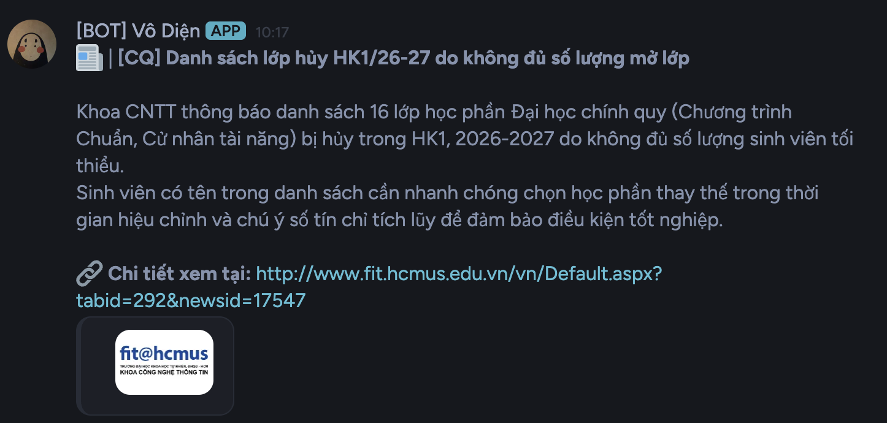 | 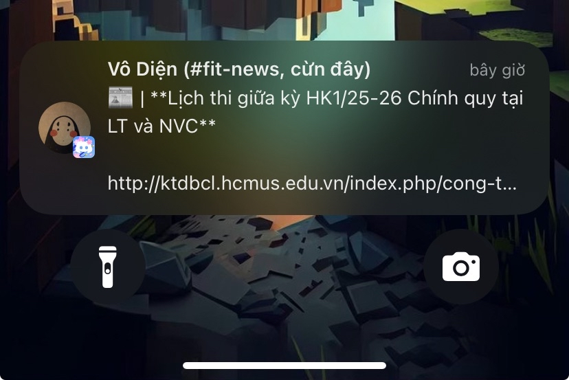 |

## Yêu cầu:

Hiện tại mình có 2 phiên bản: Discord và Telegram

- Discord: [Link bot Vô Diện](https://discord.com/oauth2/authorize?client_id=1395723998821879849&permissions=0&integration_type=0&scope=bot+applications.commands)

- Telegram: [Link bot Telegram](https://t.me/hcmus_tintuc_bot)

Chức năng tương tự nhau, tùy vào bạn hay dùng cái nào để chọn.

## Command

- `/hcmus-news latest <category> <number>`: trả về tin gần nhất dựa theo danh mục bạn chọn (số lượng từ 1 - 5).
- `/hcmus-news setup`: thiết lập kênh sẽ nhận thông báo
- `/hcmus-news status`: hiển thị trạng thái và thông tin của kênh nhận thông báo.
- `/hcmus-news remove`: hủy thiết lập của kênh nhận thông báo.

## Hướng dẫn

1. Cài đặt ứng dụng [Discord](https://discord.com/) trên máy của bạn (Laptop, Android hay iOS đều được).

2. Login hoặc đăng ký tài khoản Discord nếu bạn chưa có.

3. Tạo một server mới (nên tạo server riêng để nhận tin cho dễ quản lý và lấy quyền admin)

  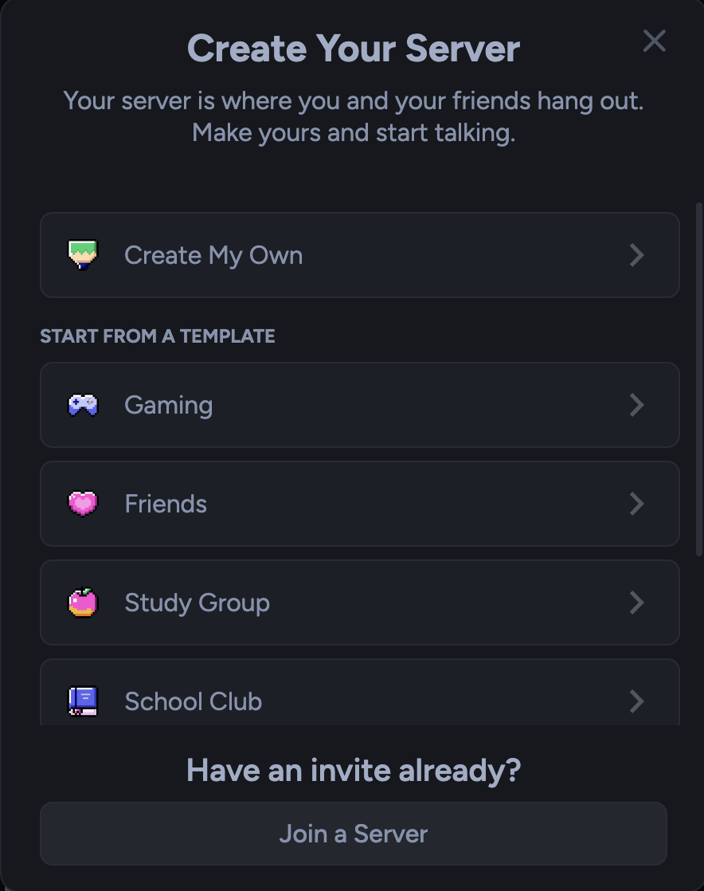

4. Thêm bot vào server của bạn bằng cách ấn vào link sau: [Bot Vô Diện](https://discord.com/oauth2/authorize?client_id=1395723998821879849&permissions=0&integration_type=0&scope=bot+applications.commands)

- Chọn `Add to Server`

  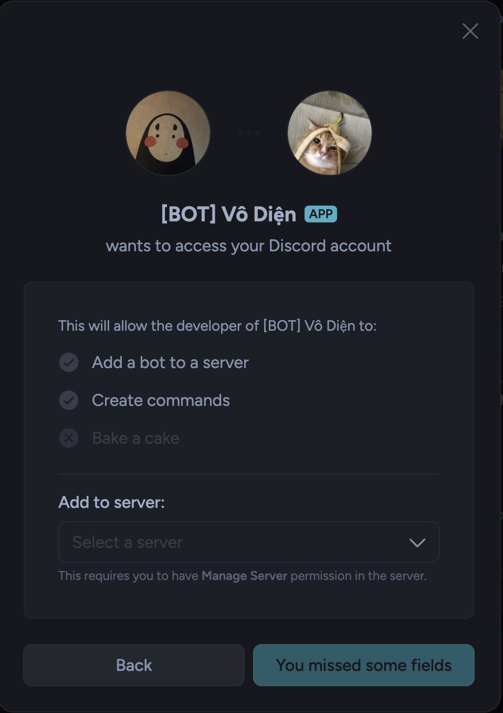

- Chọn server bạn vừa tạo ở bước 3 rồi ấn `Authorize`.

5. Vào lại server, click vào dấu cộng như hình để tạo một kênh mới, đặt tên tùy thích nhma nhớ chọn loại kênh là `Text` sau đó ấn `Create Channel`.

  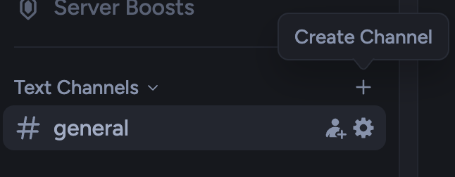

  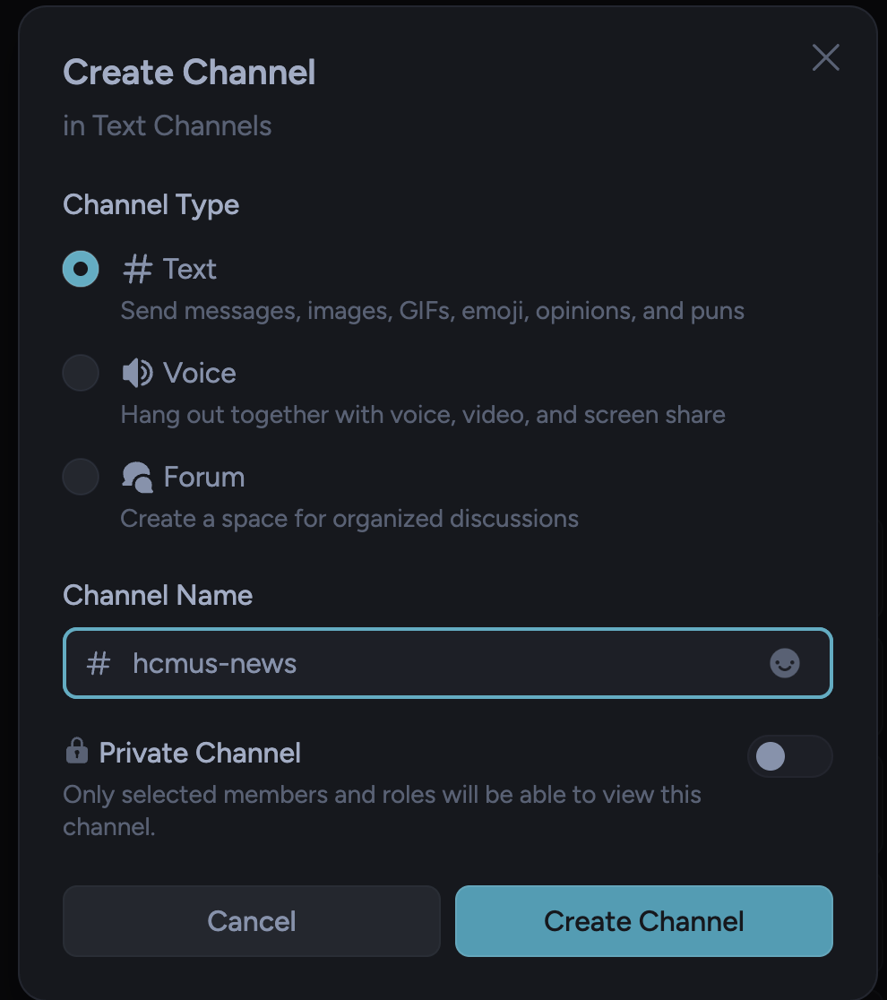

6. Vào kênh vừa tạo, dưới thanh chat, gõ lệnh `/hcmus-news`, bạn sẽ thấy có 4 lệnh hiện ra như hình.

> Nếu chưa thấy thì bạn nên quay lại bước 4 và mời lại bot vào server.

  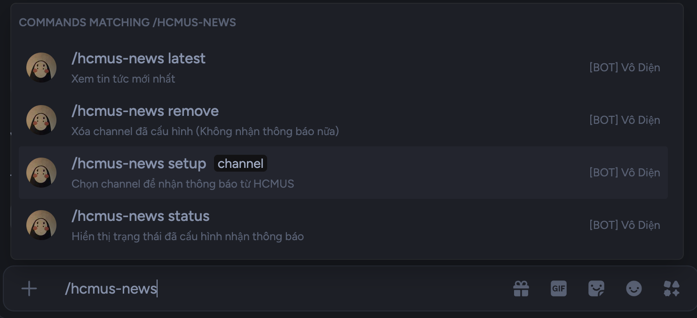

7. Chọn lệnh `/hcmus-news setup`, bạn sẽ thấy hiện ra 1 loạt channel như hình, bạn tìm tên của channel bạn đã tạo ở bước 5, chọn nó và nhấn Enter.

  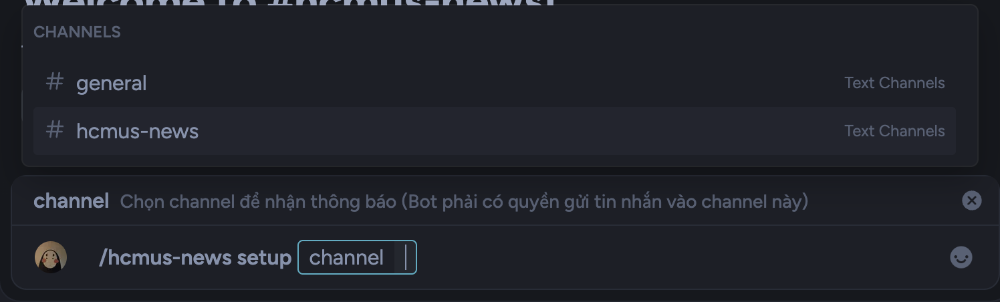

Nhấn `Xác nhận` để hoàn tất thiết lập.

  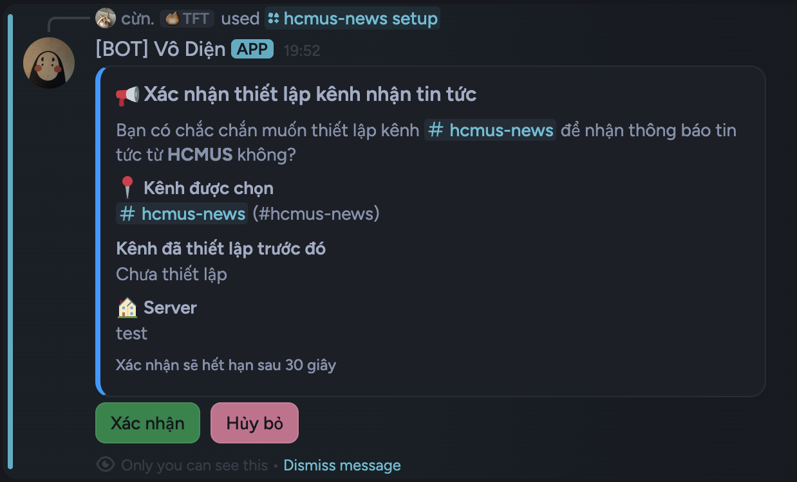

8. Bạn sẽ nhận 2 thông báo, 1 thông báo báo rằng bạn đã setup thành công và 1 thông báo nằm trong kênh bạn đã chọn báo rằng kênh này đã được thiết lập để nhận thông báo từ bot.

  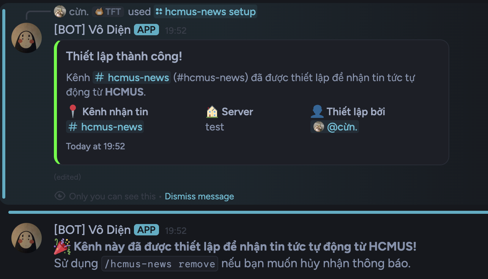

- Vậy là thành công, mỗi khi có tin mới từ các web của HCMUS, bot sẽ tự động gửi tin vào kênh bạn đã chọn như phần Demo ở trên, thời gian quét thông báo để gửi là 10 phút / lần.

- Nếu bạn không muốn nhận tin nữa, bạn chỉ cần vào kênh đó gõ lệnh `/hcmus-news remove`, xác nhận là xong, sẽ không còn thông báo nào gửi đến nữa.

  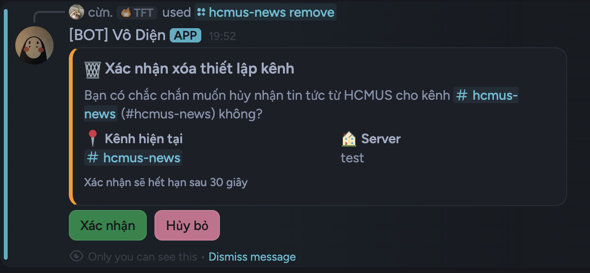

  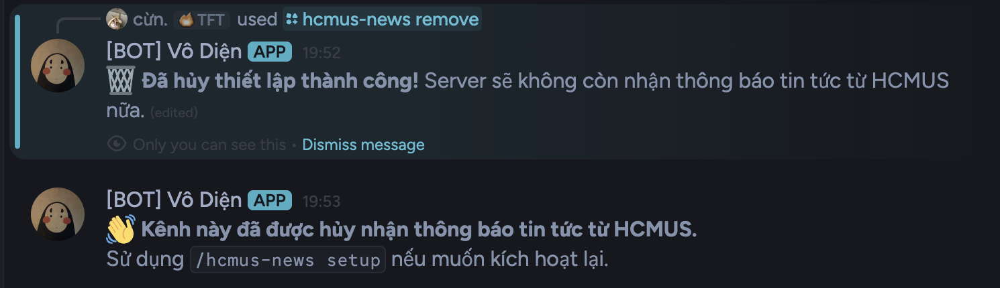

### <samp> Setup thành công rồi thì xin một star cho repo này nhé :3</samp>

## Resource:

Các web của HCMUS mà bot sẽ theo dõi để gửi thông báo (nguồn chính thống):

| Category                     | URL                                                                        |
| ---------------------------- | -------------------------------------------------------------------------- |
| Thông tin dành cho sinh viên | https://hcmus.edu.vn/category/dao-tao/dai-hoc/thong-tin-danh-cho-sinh-vien |
| Lịch thi - Phòng khảo thí    | https://ktdbcl.hcmus.edu.vn/index.php/cong-tac-kh-o-thi/l-ch-thi-h-c-ky    |
| Thông báo - Phòng khảo thí   | https://ktdbcl.hcmus.edu.vn/index.php/thong-bao                            |
| Khoa CNTT - FIT@HCMUS        | https://www.fit.hcmus.edu.vn/tin-tuc                                       |
| CLC/APCS - CTĐA@HCMUS        | https://www.ctda.hcmus.edu.vn/vi/thong-bao/                                |
| Tin tức chung - HCMUS        | https://hcmus.edu.vn/category/tin-tuc                                      |

---
